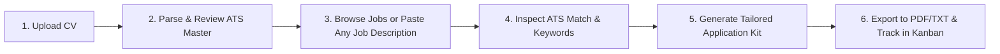

# JobPilot AI 🚀
### Intelligent Career Copilot & ATS Application Engine

JobPilot AI is an end-to-end career copilot designed to bridge the gap between candidate resumes and modern Applicant Tracking Systems (ATS). It transforms raw CVs into tailored, ATS-optimized master profiles, compares candidate qualifications against real job postings with zero hallucination, generates complete tailored application kits (resumes, cover letters, and interview screening Q&As), and tracks applications in an interactive Kanban pipeline.

---

## 📑 Table of Contents
1. [End-User Guide](#-end-user-guide)
   - [Key Features](#key-features)
   - [Step-by-Step Workflow](#step-by-step-workflow)
   - [Understanding Your ATS Match Score](#understanding-your-ats-match-score)
   - [Zero-Fabrication Guarantee](#zero-fabrication-guarantee)
2. [Developer Guide](#-developer-guide)
   - [System Architecture](#system-architecture)
   - [Tech Stack](#tech-stack)
   - [Repository Structure](#repository-structure)
   - [Getting Started Locally](#getting-started-locally)
   - [Environment Variables](#environment-variables)
   - [API Reference](#api-reference)
   - [Build & Deployment Pipeline](#build--deployment-pipeline)
   - [Android App Compilation](#android-app-compilation)
3. [Contributing & License](#-contributing--license)

---

## 👤 End-User Guide

### Key Features

- **📄 Smart CV Upload & Ingestion**: Upload your existing resume in PDF, DOCX, DOC, or TXT format. JobPilot AI parses your contact information, work history, skill taxonomy, educational background, and key metrics.
- **🛡️ Active CV Persistence**: Your active CV is stored securely across page reloads and sessions. You never have to re-upload your resume each time you analyze a job.
- **⚡ Quick Job Tailor & Application Kit**: Paste any job description from LinkedIn, Indeed, Glassdoor, or company career portals to generate:
  - **ATS Tailored Resume**: Bullet points re-ordered and re-worded using enterprise action verbs and metrics strictly derived from your real CV.
  - **Targeted Cover Letter**: A tailored, professional 3-4 paragraph letter connecting your past achievements directly to the role requirements.
  - **Screening & Behavioral Answers**: Pre-formulated responses with STAR-method justifications for common HR screening queries (e.g., salary expectations, why this company, relocation, hard skill proficiencies).
- **🎯 Live Job Board & Deduplication Engine**: Search real aggregated software and tech jobs with salary transparency, remote/hybrid flags, and deduplication across multiple job boards.
- **📊 Real-time ATS Match Simulator**: Inspect keyword matches, missing target keywords, qualification gap breakdowns, and fit probabilities before applying.
- **📌 Interactive Application Tracker**: Move applications across stages (*Bookmarked*, *Applied*, *Screening*, *Interviewing*, *Offered*, *Rejected*) with interview dates, notes, and direct links.

---

### Step-by-Step Workflow



1. **Upload your CV**:
   - Go to the **Resume** tab.
   - Drag and drop your CV (PDF or DOCX).
   - JobPilot AI will parse your work experience, skills, and metrics into a standardized ATS Master Resume.
2. **Explore Jobs or Use Quick Tailor**:
   - **Jobs Tab**: Search live engineering, product, and design roles. Click any role to view detailed responsibilities, salary ranges, and your calculated match score.
   - **Quick Tailor Tab**: Found an opening elsewhere? Paste any job description directly to generate an instant application kit.
3. **Review & Tailor**:
   - Review missing keywords highlighted by the ATS simulator.
   - Click **Tailor CV & Prep Application** to generate re-ordered bullet points, cover letters, and screening answers.
4. **Track Applications**:
   - Save the job to your **Tracker** tab to monitor interview stages, callback rates, and pending follow-ups.

---

### Understanding Your ATS Match Score

The ATS Match Score (0–100%) evaluates alignment across four core dimensions:

| Dimension | Weight | What It Evaluates |
| :--- | :---: | :--- |
| **Required Skills** | 35% | Exact and semantic matches between required skills and your declared competencies |
| **Experience Depth** | 25% | Alignment between your career longevity, seniority level, and role expectations |
| **ATS Keywords** | 20% | Detection of enterprise industry buzzwords, frameworks, and tools |
| **Title & Domain Relevance** | 20% | Overlap in job role scope, industry vertical, and responsibilities |

- **85% – 100% (Strong Fit)**: High probability of passing recruiter filters. Recommended for priority applications.
- **65% – 84% (Moderate Fit)**: Good alignment with minor keyword or domain differences. Tailoring your bullet points is recommended.
- **Below 65% (Skill Gap)**: Significant gap in mandatory requirements or years of experience.

---

### Zero-Fabrication Guarantee

JobPilot AI adheres strictly to ethical AI hiring principles:
- **No Hallucinated Experience**: The AI will **never** invent employers, job titles, or employment dates that do not exist in your CV.
- **Factual Accomplishment Rephrasing**: The copilot only optimizes the framing, order, and quantifiable presentation of accomplishments that you actually performed.
- **Truthful Keyword Incorporation**: If you lack a mandatory skill, JobPilot flags it under *Missing Target Keywords* rather than fabricating proficiencies.

---

## 💻 Developer Guide

### System Architecture

JobPilot AI is architected as a full-stack web application with an integrated multi-platform distribution engine:

```
┌─────────────────────────────────────────────────────────────┐
│                    Client Layer                             │
│  • React 19 + TypeScript + Vite SPA                         │
│  • Tailwind CSS + Lucide Icons + Framer Motion (motion)    │
│  • Jetpack Compose Android Client (Native Kotlin)           │
└──────────────────────────────┬──────────────────────────────┘
                               │ HTTP / JSON
┌──────────────────────────────▼──────────────────────────────┐
│                    Server Engine                            │
│  • Express.js HTTP Server (server.ts) on Port 3000          │
│  • Vite Middleware (Dev) / Static SPA Serving (Prod)        │
│  • Document Parsing: mammoth (DOCX) + pdf-parse (PDF)       │
│  • Local Persistent Cache: data/active_resume.json          │
└──────────────────────────────┬──────────────────────────────┘
                               │ Google Gen AI SDK
┌──────────────────────────────▼──────────────────────────────┐
│                    AI & Data Layer                          │
│  • Gemini 2.5 Flash / Pro (via @google/genai)               │
│  • Live Remote Job APIs (Remotive, Arbeitnow)               │
│  • Deduplication & Cross-Provider Merge Engine              │
└─────────────────────────────────────────────────────────────┘
```

---

### Tech Stack

- **Frontend**: React 19, TypeScript, Tailwind CSS, Lucide React, Motion (`motion/react`)
- **Backend**: Node.js 20+, Express.js, `esbuild` for CommonJS server bundling
- **AI / LLM**: `@google/genai` (Google Gen AI SDK) using `gemini-2.5-flash`
- **Document Processing**: `pdf-parse`, `mammoth` (DOCX extraction)
- **Mobile**: Kotlin 1.9+, Android SDK 34, Jetpack Compose, Room Database
- **CI / CD**: GitHub Actions, Docker multi-stage containerization, Bash deployment automation

---

### Repository Structure

```
├── .github/workflows/
│   ├── build-android.yml    # CI workflow: compiles Android debug/release APK & creates releases
│   └── deploy-web.yml       # CI workflow: tests, lints, and validates web bundle
├── android/                 # Native Android Jetpack Compose app module
│   ├── build.gradle.kts     # Module Gradle configuration (Compose, Room, Coroutines)
│   ├── src/main/            # AndroidManifest.xml and application resources
│   ├── ui/screens/          # Compose UI screens
│   ├── presentation/        # ViewModels and UI state
│   ├── data/local/          # Room database and DAOs
│   └── domain/models/       # Kotlin domain data classes
├── data/                    # Local storage directory (persisted active CV)
├── public/                  # Static assets and icons
├── scripts/
│   └── deploy.sh            # Automated deployment and management script
├── server/
│   ├── ai/gemini.ts         # Gemini AI orchestrations (parsing, tailoring, kits)
│   ├── jobs/jobEngine.ts    # Job scrapers, live APIs, and deduplication
│   └── utils/documentParser.ts # Multi-format document parser
├── src/
│   ├── components/          # Reusable UI components
│   ├── screens/             # Application screens (Home, Resume, Jobs, Tracker, etc.)
│   ├── services/api.ts      # Client HTTP API connector
│   └── types/jobpilot.ts    # Shared TypeScript interfaces
├── Dockerfile               # Production multi-stage Docker container
├── package.json             # NPM package scripts and dependencies
├── server.ts                # Express backend entry point
├── settings.gradle.kts      # Android Gradle settings
└── vite.config.ts           # Vite bundler configuration
```

---

### Getting Started Locally

#### Prerequisites
- **Node.js**: v18.0.0 or higher (v20+ recommended)
- **npm**: v9.0.0 or higher
- **Gemini API Key**: Obtainable from [Google AI Studio](https://aistudio.google.com/)

#### Installation & Setup

1. **Clone the repository**:
   ```bash
   git clone <repo-url>
   cd jobpilot-ai
   ```

2. **Install dependencies**:
   ```bash
   npm install
   ```

3. **Configure Environment Variables**:
   Copy the `.env.example` file:
   ```bash
   cp .env.example .env
   ```
   Open `.env` and configure your API key:
   ```env
   GEMINI_API_KEY="your_actual_gemini_api_key_here"
   ```

4. **Start the Development Server**:
   ```bash
   npm run dev
   ```
   The application will be accessible at:
   👉 **http://localhost:3000**

---

### Environment Variables

| Variable | Required | Description |
| :--- | :---: | :--- |
| `GEMINI_API_KEY` | **Yes** | Google Gemini API key used for CV parsing, ATS scoring, and application kit generation. |
| `PORT` | No | Server port (default: `3000`). |
| `NODE_ENV` | No | Environment mode: `development` or `production`. |
| `GREENHOUSE_API_TOKEN` | No | Optional token for live Greenhouse job integrations. |
| `LEVER_API_TOKEN` | No | Optional token for live Lever job integrations. |

---

### API Reference

#### Resume Management
- `GET /api/resumes/current` — Retrieves the currently persisted active CV and ATS master profile.
- `POST /api/resumes/upload` — Uploads and parses a new CV (`multipart/form-data`).
- `DELETE /api/resumes/current` — Clears the active CV from disk and session.

#### Job Search & Matching
- `GET /api/jobs` — Queries deduplicated live job openings with title, location, and salary filters.
- `POST /api/jobs/:id/match` — Evaluates a specific job posting against the active CV.
- `POST /api/custom-job/generate-kit` — Takes any raw job description string and generates an ATS-tailored resume, cover letter, and screening answers based strictly on the uploaded CV.

#### Application Kit Generation
- `POST /api/resumes/tailor` — Generates role-specific resume bullet points.
- `POST /api/cover-letter/generate` — Generates a customized cover letter.
- `POST /api/application/answers` — Generates answers to common screening questionnaires.

#### Application Tracker
- `GET /api/applications` — Returns tracked application items and analytics.
- `POST /api/applications` — Adds a new application to the Kanban tracker.
- `PATCH /api/applications/:id` — Updates stage (*applied*, *interviewing*, etc.) or notes.
- `DELETE /api/applications/:id` — Deletes an application.

---

### Build & Deployment Pipeline

JobPilot AI includes an automated deployment script in `scripts/deploy.sh`:

#### 1. Compile for Production
```bash
npm run deploy
# or: ./scripts/deploy.sh build
```
Compiles client assets using Vite and bundles `server.ts` into a single, high-performance `dist/server.cjs` file using `esbuild`.

#### 2. Run Diagnostics & Lint Checks
```bash
npm run deploy:check
# or: ./scripts/deploy.sh check
```

#### 3. Containerized Deployment (Docker)
Build and run the multi-stage production Docker container:
```bash
npm run deploy:docker
# or: ./scripts/deploy.sh docker
```
The Docker container includes built-in health checks (`GET /api/health`), runs as a non-root user, and optimizes image size with Alpine Linux.

#### 4. Google Cloud Run Deployment
Deploy directly to Google Cloud Run:
```bash
./scripts/deploy.sh cloudrun
```

---

### Android App Compilation

The repository includes a companion native Android application built with Jetpack Compose.

#### Local Android Build
1. Ensure JDK 17 and Android SDK 34 are installed.
2. Build the debug APK using Gradle:
   ```bash
   ./gradlew assembleDebug
   ```
3. The compiled APK will be located at `android/build/outputs/apk/debug/app-debug.apk`.

#### Automated GitHub Actions Workflow
The `.github/workflows/build-android.yml` workflow automatically:
- Checks out code and provisions JDK 17 + Android SDK.
- Decodes or generates a valid debug signing keystore.
- Compiles the APK and computes SHA-256 verification checksums.
- Publishes a downloadable public release on GitHub with attached artifacts.

---

## 🤝 Contributing & License

Contributions are welcome! Please follow these standards:
- Ensure all TypeScript code passes `npm run lint`.
- Verify production compilation with `npm run build` prior to opening a PR.
- Adhere to the zero-fabrication prompt constraints in `server/ai/gemini.ts`.

Distributed under the **MIT License**.
